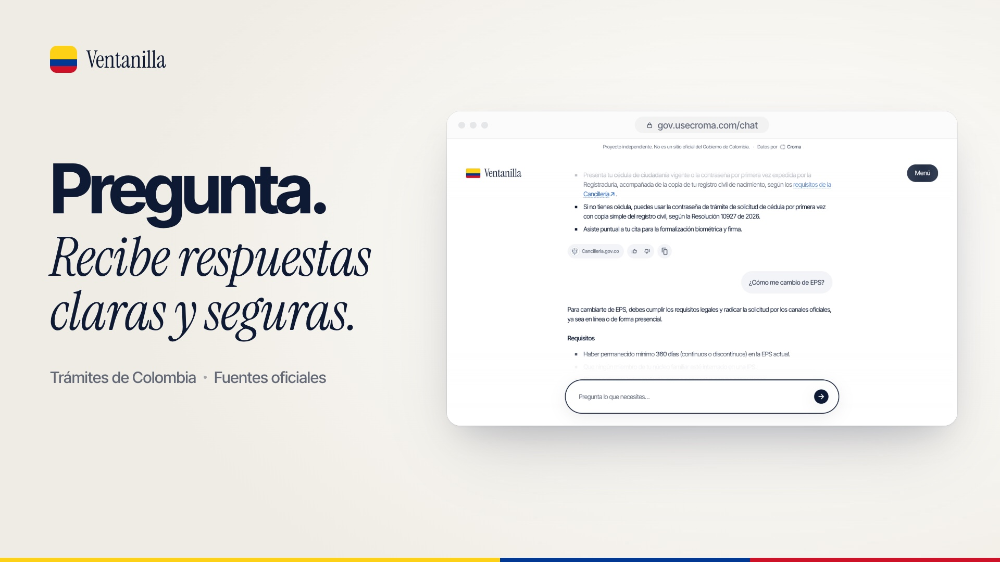

# Ventanilla

Answers about government services, from official sources only. Colombia first.

[gov.usecroma.com](https://gov.usecroma.com) · Sources by [Croma](https://docs.usecroma.com) · Not an official government site.



## Run

```bash
npm install
cp .env.example .env.local   # add CROMA_API_KEY and GROQ_API_KEY
npm run dev
```

Requires Node 24.

## How it works

1. Search official sources.
2. Draft an answer.
3. Check every claim against the sources.
4. Answer with only what was confirmed, and cite it.

## Privacy

No cookies and no cross-site tracking; page views are counted with cookieless Vercel Web Analytics. Personal data like ID numbers and phones is blocked before it's sent, and questions are kept without it for 7 days to improve the answers. More in [SECURITY.md](SECURITY.md).

## Add a country

Copy `src/countries/co/`, adapt it, and build with `COUNTRY=<code>`.

## Contributing

[CONTRIBUTING.md](CONTRIBUTING.md)

## License

[MIT](LICENSE). Entity names and icons belong to their entities.
